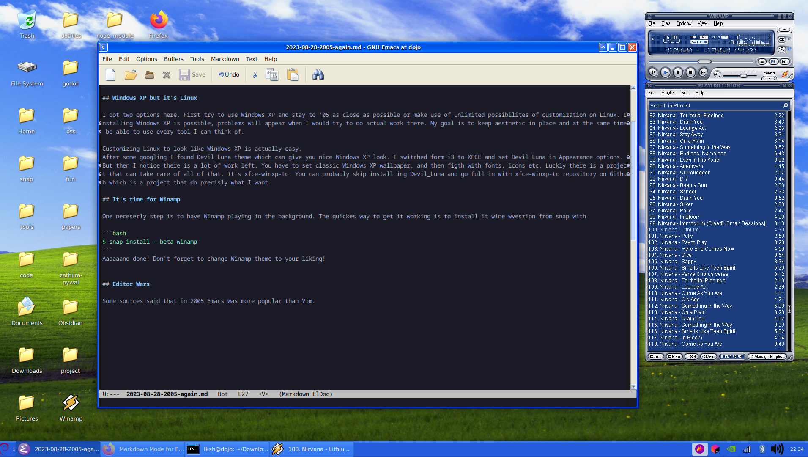

I got the idea for another theme of my streaming setup. We are going full nostalgia here aiming for 2005 aesthetic. That means we have couple componenets to setup in place. First we have to get that Windows XP feeling.


## Windows XP but it's Linux

I got two options here. First try to use Windows XP and stay to '05 as close as possible or make use of unlimited possibilites of customization on Linux. Installing Windows XP is possible, problems will appear when I would try to do actual work there. My goal is to keep aesthetic in place and at the same time be able to use every tool I can think of.

Customizing Linux to look like Windows XP is actually easy.
After some googling I found Devil_Luna theme which can give you nice Windows XP look. I switched form i3 to XFCE and set Devil_Luna in Appearance options. But then I notice there is a lot of work left. You have to set classic Windows XP wallpaper, and then figth with fonts, icons etc. Luckly there is a project that can take care of all of that. It's xfce-winxp-tc. You can probably skip install ing Devil_Luna and go full in with xfce-winxp-tc repository on Github which is a project that do precisly what I want. 

## It's time for Winamp

One neceserly step is to have Winamp playing in the background. The quickes way to get it working is to install it wine wvesrion from snap with

```bash
$ snap install --beta winamp
```
Aaaaaand done! Don't forget to change Winamp theme to your liking!


## Editor Wars

Some sources said that in 2005 Emacs was more popular than Vim. 



